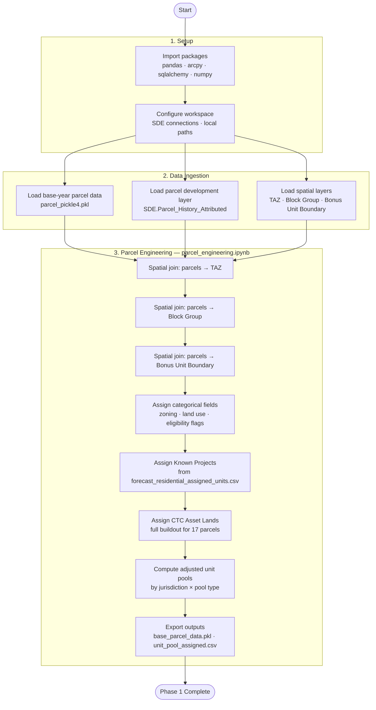
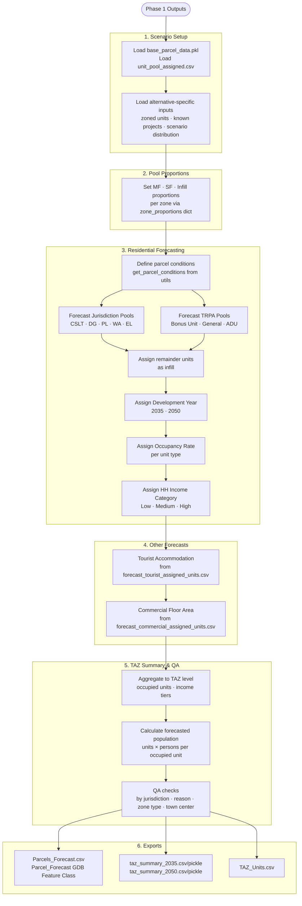

# 2026 Housing EIS — Development Forecast

**Project:** 2026 Housing Element Environmental Impact Study (EIS)
**Purpose:** Parcel-level development forecasting for 2035 and 2050 model years to support the Tahoe Regional Transportation Plan (RTP) and Housing EIS alternatives analysis.

---

## Overview

This folder contains the full forecasting workflow for the Lake Tahoe Basin Housing EIS. The workflow is split into two phases: **shared data engineering** (parcel preparation and base unit pool assembly) and **scenario-specific forecasting** (per-alternative unit allocation, TAZ summaries, and travel demand model inputs). Four housing policy alternatives are evaluated, each with its own unit distribution assumptions and known-projects list.

---

## Scenarios at a Glance

| Alternative | Name | Total New Units | Key Differentiator |
| --- | --- | --- | --- |
| Alternative 1 | No Project (RTP/SCS Baseline) | 4,319 | Replicates the adopted RTP/SCS forecast; no new bonus unit incentives or JADU program |
| Alternative 2 | Housing Forward | 8,428 | Maximum housing production; full pool conversion, expanded bonus units, JADUs, missing middle |
| Alternative 3 | Housing Preservation | 4,319 | Same unit total as No Project; achieves housing need through preservation and conversion, not new incentives |
| Alternative 4 | No Stormwater Change | ~5,150 | Intermediate production; partial pool conversion and limited JADU program, no stormwater coverage incentives |

---

## Scenario Descriptions

### Alternative 1 — No Project (RTP/SCS Baseline)

**Policy intent:** Represents the continuation of existing land use policy with no new housing incentives. This is the baseline against which all other alternatives are measured. Unit assumptions match the 2022 RTP/SCS forecast, updated only for known development activity between 2022 and 2025.

**Unit pool summary:**

| Pool | Units | Where Distributed |
|---|---|---|
| Affordable Bonus Units | 211 | Within Bonus Unit Boundary |
| Moderate Bonus Units | 271 | Within Bonus Unit Boundary |
| Achievable Bonus Units | 20 | Within Bonus Unit Boundary |
| Affordable by Design | 0 | — |
| JADUs | 0 | — |
| Private CFA/TAU Conversion | 700 | Anywhere residential allowed |
| Banked Residential Units | 399 | Anywhere residential allowed |
| Local Jurisdiction BU Pool (unassigned) | 238 | Model assigns |
| Local Jurisdiction BU Pool (assigned projects) | 427 | Model assigns |
| Remaining 2012 RP Allocations | 1,956 | Model assigns |
| **Total New Units** | **4,319** | |

**Key assumptions:**

- No conversion of unused CFA/TAU/PAOT development rights to bonus units
- No Junior ADU (JADU) program
- Affordable/Moderate bonus units directed entirely within the Bonus Unit Boundary to capture fee waivers
- Remaining 2012 Regional Plan allocations: 33% multifamily (100% occupied), 66% single-family
- ADU pool = 110 units (no Washoe County expansion beyond what the updated ADU condition allows)
- TRPA Bonus Unit pool = 388; TRPA General pool = 948

**Changes from RTP model run (common to all alternatives):**

1. Known residential unit changes from 2022–2025 pre-incorporated into the input parcel pickle
2. Zoned unit pools adjusted for construction activity 2022–2025 (per K. Kasman)
3. Updated known projects list
4. ADUs now allowed in Washoe County (ADU eligibility condition updated)
5. 33% of allocations assumed multifamily (100% occupied); remaining 66% single-family
6. Population in 2035 and 2050 allowed to vary based on persons per household and occupancy rate

---

### Alternative 2 — Housing Forward

**Policy intent:** Emphasizes housing production and preservation outcomes by strengthening incentives for workforce and deed-restricted housing, expanding the scope of bonus unit and fee reforms, and activating new unit categories (JADUs, missing middle) while maintaining required environmental protections and growth limits. Adds approximately 3,316 units above the No Project baseline (net 8,428 total new units).

**Unit pool summary:**

| Pool | Units | Where Distributed |
|---|---|---|
| Affordable Bonus Units | 1,527 | Within Bonus Unit Boundary |
| Moderate Bonus Units | 955 | Within Bonus Unit Boundary |
| Achievable Bonus Units | 764 | 65% within BUB / 35% anywhere |
| Affordable by Design | 382 | Anywhere residential allowed |
| JADUs | 792 | Anywhere residential allowed |
| Private CFA/TAU Conversion | 700 | Anywhere residential allowed |
| Banked Residential Units | 399 | Anywhere residential allowed |
| Local Jurisdiction BU Pool (unassigned) | 238 | Anywhere residential allowed |
| Local Jurisdiction BU Pool (assigned projects) | 427 | Model assigns |
| Remaining 2012 RP Allocations | 1,956 | Model assigns |
| Achievable General Pool | 191 | Anywhere residential allowed |
| **Total New Units** | **8,428** | |

**Key assumptions:**

- Full conversion of unused CFA/TAU/PAOT development rights to residential bonus units, generating substantially larger Affordable (1,527), Moderate (955), and Achievable (955) pools
- Active JADU program: 32 units/year from 2027–2050 = 792 JADUs distributed throughout the region
- Affordable by Design bonus units (382) distributed anywhere residential development is allowed
- 65% of Achievable Bonus units within Bonus Unit Boundary; 35% anywhere
- Remaining jurisdictional pool units distributed 100% anywhere residential development is allowed (not constrained to MF parcels)
- TRPA Bonus Unit pool = 947; TRPA General pool = 1,174; ADU pool = 150
- Missing middle housing allowed in more neighborhoods

---

### Alternative 3 — Housing Preservation

**Policy intent:** Focuses on achieving housing need through the **preservation and conversion of existing housing** to workforce housing, rather than new production incentives. Requires that a defined percentage of a jurisdiction's housing stock is owned or rented by local workers. Adopts only a subset of proposed policy components — without zoning incentives, bonus unit reforms, coverage incentives, excess coverage mitigation fee changes, or new JADU incentives. No mapping changes from the No Project alternative. Unit total is the same as Alternative 1 (4,319), but with slightly more flexible spatial distribution.

**Unit pool summary:**

| Pool | Units | Where Distributed |
|---|---|---|
| Affordable Bonus Units | 211 | Within Bonus Unit Boundary |
| Moderate Bonus Units | 271 | Within Bonus Unit Boundary |
| Achievable Bonus Units | 20 | Within Bonus Unit Boundary |
| Affordable by Design | 0 | — |
| JADUs | 0 | — |
| Private CFA/TAU Conversion | 700 | Anywhere residential allowed |
| Banked Residential Units | 399 | Anywhere residential allowed |
| Local Jurisdiction BU Pool (unassigned) | 238 | Anywhere residential allowed |
| Local Jurisdiction BU Pool (assigned projects) | 427 | Model assigns |
| Remaining 2012 RP Allocations | 1,956 | Model assigns |
| **Total New Units** | **4,319** | |

**Key assumptions:**

- No conversion of unused development rights pools to bonus units
- No new JADU incentives
- No coverage incentives for multifamily or changes to the Excess Coverage Mitigation Fee
- No new incentives for missing middle housing
- Bonus unit and general pool sizes match the updated (post-2025) jurisdiction pools but without new Affordable/Moderate/Achievable categories
- TRPA Bonus Unit pool = 947; TRPA General pool = 1,174; ADU pool = 150
- Achievable Bonus distribution set within Bonus Unit Boundary (same as No Project)
- Spatial distribution of remaining pools is slightly more flexible than Alt 1 (1,337 units "anywhere" vs. 1,099), reflecting WTAP passage allowing Washoe County ADUs
- Sets an explicit target for new occupied residential units (model calibrates to this target)

---

### Alternative 4 — No Stormwater Change

**Policy intent:** Excludes changes to **coverage limits for multifamily housing** and changes to **excess coverage mitigation fees** — focusing incentives in areas with existing area-wide stormwater treatment. Still provides some support for workforce housing through partial conversion of unused development rights to residential bonus units and expanding uses of bonus units. Some zoning incentives apply (e.g., missing middle in more neighborhoods), but more limited scope than Housing Forward. Up to a fourplex allowed in any residential zone within ½ mile of transit, a town center, or within multifamily zones. Jurisdictions may optionally update area plans for Phase 2 height/density/coverage/parking incentives for Tier 3 housing. Unit total falls between the No Project and Housing Forward alternatives.

**Unit pool summary:**

| Pool | Units | Where Distributed |
|---|---|---|
| Affordable Bonus Units | 258 | Within Bonus Unit Boundary |
| Moderate Bonus Units | 161 | Within Bonus Unit Boundary |
| Achievable Bonus Units | 161 | 65% within BUB / 35% anywhere |
| Affordable by Design | 64 | Anywhere residential allowed |
| JADUs | 154 | Anywhere residential allowed |
| Private CFA/TAU Conversion | 700 | Anywhere residential allowed |
| Banked Residential Units | 399 | Anywhere residential allowed |
| Local Jurisdiction BU Pool (unassigned) | 238 | Anywhere residential allowed |
| Local Jurisdiction BU Pool (assigned projects) | 427 | Model assigns |
| Remaining 2012 RP Allocations | 1,956 | Model assigns |
| Achievable General Pool | 32 | Anywhere residential allowed |
| **Total New Units** | **~5,150** | |

**Key assumptions:**

- Partial conversion of unused CFA/TAU/PAOT development rights — smaller Affordable (258), Moderate (161), and Achievable (161) pools than Housing Forward
- Limited JADU program: 154 JADUs (roughly 6.5 units/year from 2027–2050) distributed throughout the region
- No stormwater coverage incentives for multifamily; no changes to Excess Coverage Mitigation Fee
- Bonus unit and general pool sizes match the updated jurisdiction pools (same as Alt 2/3)
- TRPA Bonus Unit pool = 947; TRPA General pool = 1,174; ADU pool = 150
- Fourfold zoning: up to fourplex allowed near transit/town centers even without coverage incentives
- Tweaks the unit target input CSV relative to No Project to model the partial additional production

---

## Scenario Comparison — Key Differences

| Feature | Alt 1 (No Project) | Alt 2 (Housing Forward) | Alt 3 (Preservation) | Alt 4 (No Stormwater) |
| --- | --- | --- | --- | --- |
| CFA/TAU/PAOT Pool Conversion | No | Yes (full) | No | Yes (partial) |
| JADU Program | No | Yes (792 units) | No | Yes (154 units) |
| Affordable BU Pool | 211 | 1,527 | 0 new | 258 |
| Moderate BU Pool | 271 | 955 | 0 new | 161 |
| Achievable BU Pool | 20 | 764 | 0 new | 161 |
| Affordable by Design | 0 | 382 | 0 | 64 |
| Coverage Incentives for MF | N/A | Yes | No | No |
| Missing Middle Zoning | No | Yes (broad) | No | Yes (limited, near transit) |
| Preservation/Conversion Requirement | No | No | Yes | No |
| TRPA Bonus Unit Pool | 388 | 947 | 947 | 947 |
| TRPA General Pool | 948 | 1,174 | 1,174 | 1,174 |
| ADU Pool | 110 | 150 | 150 | 150 |
| **Total New Units** | **4,319** | **8,428** | **4,319** | **~5,150** |

---

## Folder Structure

```
Forecast/
├── README.md                          # This file
├── scripts/                           # Shared Phase 1 scripts (run once, common to all alternatives)
│   ├── parcel_engineering.ipynb       # Phase 1A: spatial joins, parcel classification, unit pool assembly
│   ├── scenario_forecast_template.ipynb  # Phase 1B: reference template for scenario notebooks
│   ├── Base_Forecast.ipynb            # Original combined notebook (source of Phase 1A/1B)
│   ├── utils.py                       # Shared helper functions
│   └── Lookup_Lists/                  # Shared input CSVs (zoned units, assigned units, CTC lands, etc.)
├── data/                              # Shared processed data outputs
│   ├── base_parcel_data.pkl           # Engineered parcel layer (output of Phase 1A)
│   ├── unit_pool_assigned.csv         # Adjusted unit pools after known-project subtraction
│   ├── taz_summary_2035.csv/.pickle   # TAZ-level summary — 2035 model year
│   ├── taz_summary_2050.csv/.pickle   # TAZ-level summary — 2050 model year
│   ├── Parcels_Forecast.csv           # Parcel-level forecast (tabular)
│   └── TAZ_Units.csv                  # Existing and forecasted residential units by TAZ
├── Alternative_1/                     # Housing Alternative 1: No Project (RTP/SCS Baseline)
│   ├── Alternative_1_Forecast.ipynb
│   ├── utils.py
│   ├── inputs/                        # Alternative-specific zoned units and scenario distribution CSVs
│   └── Changes from RTP Model Run.md
├── Alternative_2/                     # Housing Alternative 2: Housing Forward
│   ├── Alternative_2_Forecast.ipynb
│   ├── inputs/
│   └── Changes from RTP Model Run.md
├── Alternative_3/                     # Housing Alternative 3: Housing Preservation
│   ├── Alternative_3_Forecast.ipynb
│   ├── inputs/
│   └── Changes from RTP Model Run.md
└── Alternative_4/                     # Housing Alternative 4: No Stormwater Change
    ├── Alternative_4_Forecast.ipynb
    ├── inputs/
    └── Changes from RTP Model Run.md
```

---

## Process Flow

### Phase 1 — Shared Data Engineering (`scripts/`)

Run once. Outputs are shared across all alternatives.



### Phase 2 — Scenario Forecasting (per Alternative)

Run independently for each alternative using its own `inputs/` folder.



---

## Notebooks

| Notebook | Phase | Purpose |
|---|---|---|
| `scripts/parcel_engineering.ipynb` | 1A | Spatial joins, parcel classification, unit pool assembly; exports `base_parcel_data.pkl` and `unit_pool_assigned.csv` |
| `scripts/scenario_forecast_template.ipynb` | 1B | Reference template for building alternative notebooks; loads Phase 1A outputs |
| `scripts/Base_Forecast.ipynb` | — | Original combined notebook (source for the Phase 1A/1B split); kept for reference |
| `Alternative_1/Alternative_1_Forecast.ipynb` | 2 | Scenario forecast for Alternative 1 — No Project |
| `Alternative_2/Alternative_2_Forecast.ipynb` | 2 | Scenario forecast for Alternative 2 — Housing Forward |
| `Alternative_3/Alternative_3_Forecast.ipynb` | 2 | Scenario forecast for Alternative 3 — Housing Preservation |
| `Alternative_4/Alternative_4_Forecast.ipynb` | 2 | Scenario forecast for Alternative 4 — No Stormwater Change |

---

## Inputs

### Shared Inputs (`scripts/Lookup_Lists/`)

| Input | Type | Description |
|---|---|---|
| `forecast_residential_assigned_units.csv` | CSV | Known residential allocations 2023–2025 |
| `forecast_residential_zoned_units.csv` | CSV | Jurisdiction-level zoned residential unit pools |
| `forecast_tourist_assigned_units.csv` | CSV | Known tourist accommodation changes |
| `forecast_tourist_zoned_units.csv` | CSV | Jurisdiction-level zoned tourist unit pools |
| `forecast_commercial_assigned_units.csv` | CSV | Known commercial floor area changes |
| `forecast_commercial_zoned_units.csv` | CSV | Jurisdiction-level zoned commercial floor area |
| `CTC_AssetLands_Lookup.csv` | CSV | 17 CTC asset land parcels for full buildout |
| `known_projects.csv` | CSV | Master list of known development projects |
| `SocioEcon_Summer.csv` | CSV | Base-year TAZ socioeconomic data (persons per unit) |

### Alternative-Specific Inputs (`Alternative_N/inputs/`)

| Input | Type | Description |
|---|---|---|
| `forecast_residential_zoned_units.csv` | CSV | Scenario-adjusted zoned unit pool overrides |
| `known_projects.csv` | CSV | Alternative-specific known projects list |
| `scenarioN_instructions.csv` | CSV | Narrative description of scenario assumptions |
| `scenarioN_unit_distribution.csv` | CSV | Per-pool unit counts and spatial distribution targets |

### Spatial / Database Inputs

| Input | Type | Description |
|---|---|---|
| `parcel_pickle4.pkl` | Pickle | Base-year parcel data from the 2022 Travel Demand Model |
| `SDE.Parcel_History_Attributed` | SDE Feature Class | Parcel development records with attributed history |
| TAZ polygons | SDE Feature Class | Traffic Analysis Zones |
| Block Group polygons | SDE Feature Class | Census block groups |
| Bonus Unit Boundary | SDE Feature Class | TRPA bonus unit eligibility boundary |

---

## Outputs

### Shared (`data/`)

| Output | Type | Description |
|---|---|---|
| `base_parcel_data.pkl` | Pickle | Engineered parcel layer with spatial joins and classification (Phase 1A output) |
| `unit_pool_assigned.csv` | CSV | Unit pools after subtracting known projects and CTC lands |
| `Parcels_Forecast.csv` | CSV | Parcel-level forecast with all assigned attributes |
| `taz_summary_2035.pkl/.csv` | Pickle / CSV | TAZ-level summary for 2035 model year |
| `taz_summary_2050.pkl/.csv` | Pickle / CSV | TAZ-level summary for 2050 model year |
| `TAZ_Units.csv` | CSV | Existing and forecasted residential units by TAZ |

### Per Alternative

| Output | Type | Description |
|---|---|---|
| `Parcel_Forecast` | GDB Feature Class | Spatial parcel forecast for GIS use |
| `taz_summary_2035.csv/.pickle` | CSV / Pickle | Alternative-specific TAZ summary — 2035 |
| `taz_summary_2050.csv/.pickle` | CSV / Pickle | Alternative-specific TAZ summary — 2050 |

---

## Key Logic

### Two-Phase Architecture

The workflow is intentionally split so that the computationally expensive parcel engineering (spatial joins, SDE reads) only runs once. All four alternatives share the same engineered parcel layer and start from the same adjusted unit pools.

| Phase | Script | Runs | Key Output |
|---|---|---|---|
| 1A — Parcel Engineering | `parcel_engineering.ipynb` | Once | `base_parcel_data.pkl`, `unit_pool_assigned.csv` |
| 1B — Scenario Template | `scenario_forecast_template.ipynb` | Reference only | — |
| 2 — Scenario Forecast | `Alternative_N_Forecast.ipynb` | Once per alternative | TAZ summaries, parcel forecast |

### Residential Unit Allocation

Units are allocated in a strict priority order:

1. **Known Projects** — directly mapped by APN from the assigned units lookup
2. **CTC Asset Lands** — full buildout assigned to 17 specific parcels
3. **Jurisdictional Pools** — remaining units distributed by jurisdiction (CSLT, DG, PL, WA, EL) and unit type via the `zone_proportions` dictionary:
   - Multifamily (MF) — default 35% of pool (overridable per zone)
   - Single-family (SF) — default 50% of pool (overridable per zone)
   - Infill — default 15% of pool (overridable per zone)
4. **TRPA Pools** — bonus unit and general allocations administered by TRPA
5. **Remainders** — leftover pool units assigned as infill
6. **ADUs** — Accessory Dwelling Units filled to reach regional total

### Pool Proportion Overrides

Each alternative notebook contains a `zone_proportions` dictionary keyed by `(Jurisdiction, Unit_Pool)`. Any zone not listed falls back to global defaults. This allows fine-grained scenario differentiation without changing core allocation logic.

```python
zone_proportions = {
    ('CSLT', 'Bonus Unit'): {'mf': 0.50, 'sf': 0.35, 'infill': 0.15},
    # ... more overrides ...
    'default': {'mf': 0.35, 'sf': 0.50, 'infill': 0.15},
}
```

### Development Year Assignment

| Year | Share | Method |
|---|---|---|
| 2035 | ~33% of total | All "Assigned" projects + proportional random draw |
| 2050 | Remainder | Remaining parcels |

### Parcel Eligibility Conditions

Parcels are filtered by jurisdiction-specific criteria before unit assignment (defined in `utils.get_parcel_conditions()`):
- **Vacant buildable:** private, not retired, IPES score > 0 (Placer: > 726)
- **Infill:** existing residential with specific zoning
- **Bonus unit boundary:** must be within the TRPA-designated polygon
- **ADU eligible:** existing single residential unit with ADU allowed flag set

### Population Calibration

Forecasted population = occupied units × persons per occupied unit (from base-year socioeconomic data). The persons-per-unit factor is adjusted iteratively until regional population targets are met:
- **2035 target:** 55,592 persons
- **2050 target:** 57,611 persons

---

## Key Changes from RTP Model Run

The following changes are common across all alternatives (documented in each `Changes from RTP Model Run.md`):

1. Known residential unit changes from 2022–2025 are pre-incorporated into the input parcel pickle
2. Adjusted zoned unit pools to account for construction between 2022 and 2025 (per K. Kasman)
3. Updated known projects list
4. ADUs are now allowed in Washoe County
5. 33% of allocations assumed to be multi-family (100% occupied); remaining 66% single-family
6. Population in 2035 and 2050 is allowed to vary based on persons per household and occupancy rate (not fixed to a target)

---

## Dependencies

| Package | Use |
|---|---|
| `pandas` | Data manipulation |
| `arcpy` | Spatial joins, SDE reads, feature class export |
| `numpy` | Numeric operations |
| `sqlalchemy` | SQL Server database connections |
| `pathlib` | File path management |
| `pickle` | Intermediate data serialization |
| `utils.py` | Project-specific helper functions (`get_parcel_conditions`, `forecast_residential_units`, `forecast_residential_units_infill`, `get_target_sum`, `check_parcel_condition`, etc.) |

> **Environment:** Requires an ArcGIS Pro Python environment with access to the TRPA SDE geodatabase and SQL Server instances (`sql12`, `sql14`). Database credentials are read from the `DB_USER` and `DB_PASSWORD` environment variables.

---

## 2050 Model Results Summary

Summary of 2050 socioeconomic outputs across all four alternatives. Source: `SocioEcon_2050_Summary_ByScenario.xlsx`. Employment is identical across all alternatives (held constant; only residential and population vary by scenario).

### Housing & Population

| Metric | Alt 1 — No Project | Alt 2 — Housing Forward | Alt 3 — Preservation | Alt 4 — No Stormwater |
| --- | ---: | ---: | ---: | ---: |
| Total Residential Units | 54,331 | 59,156 | 54,547 | 55,377 |
| Total Occupied Units | 26,116 | 30,480 | 29,798 | 26,994 |
| Occupied Units — Low Income | 11,151 | 12,873 | 11,144 | 11,463 |
| Occupied Units — Middle Income | 5,071 | 6,231 | 7,052 | 5,440 |
| Occupied Units — High Income | 9,881 | 11,363 | 11,602 | 10,088 |
| Total Population (persons) | 57,613 | 67,089 | 65,728 | 59,514 |

### Employment

Employment is scenario-neutral — all alternatives use the same 2050 employment forecast.

| Sector | All Alternatives |
| --- | ---: |
| Retail | 3,711 |
| Service | 7,503 |
| Recreation | 2,248 |
| Gaming | 2,564 |
| Other | 10,711 |
| **Total Employment** | **26,737** |

### Income Distribution of Occupied Units (2050)

| Income Tier | Alt 1 — No Project | Alt 2 — Housing Forward | Alt 3 — Preservation | Alt 4 — No Stormwater |
| --- | ---: | ---: | ---: | ---: |
| % Low Income | 42.7% | 42.3% | 37.4% | 42.5% |
| % Middle Income | 19.4% | 20.5% | 23.7% | 20.2% |
| % High Income | 37.9% | 37.3% | 38.9% | 37.4% |

> Alt 3 (Preservation) shifts the most toward middle-income occupancy (+4.3 pp vs. Alt 1), driven by its workforce preservation and conversion requirements.

### Difference from No Project Baseline (Alt 1)

| Metric | Alt 2 vs. Alt 1 | Alt 3 vs. Alt 1 | Alt 4 vs. Alt 1 |
| --- | ---: | ---: | ---: |
| Total Residential Units | +4,825 (+8.9%) | +216 (+0.4%) | +1,046 (+1.9%) |
| Total Occupied Units | +4,364 (+16.7%) | +3,682 (+14.1%) | +878 (+3.4%) |
| Occ. Units — Low Income | +1,722 (+15.4%) | −7 (−0.1%) | +312 (+2.8%) |
| Occ. Units — Middle Income | +1,160 (+22.9%) | +1,981 (+39.1%) | +369 (+7.3%) |
| Occ. Units — High Income | +1,482 (+15.0%) | +1,721 (+17.4%) | +207 (+2.1%) |
| Total Population | +9,476 (+16.4%) | +8,115 (+14.1%) | +1,901 (+3.3%) |

> Alt 2 (Housing Forward) produces the largest absolute gains in population and housing. Alt 3 (Preservation) achieves similar population and occupied-unit growth to Alt 2 despite adding far fewer total units, reflecting a higher average occupancy rate driven by its preservation/conversion mandate.
