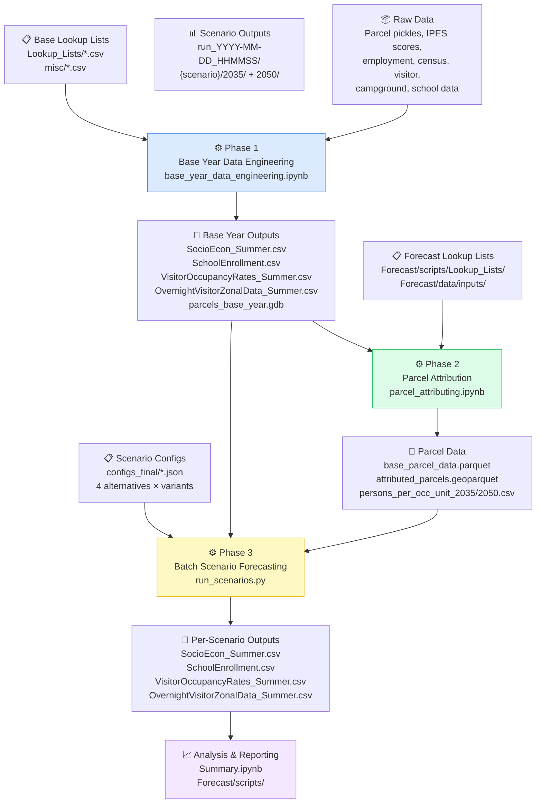
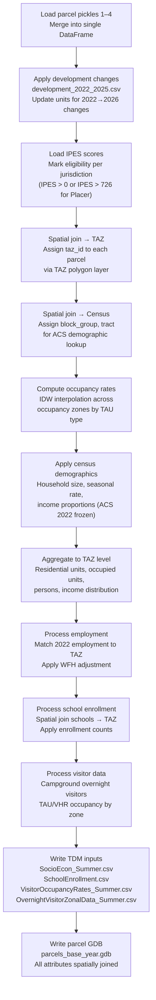
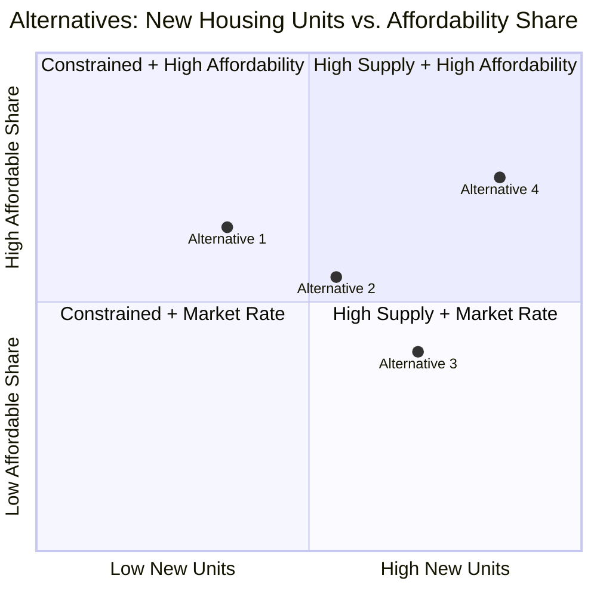
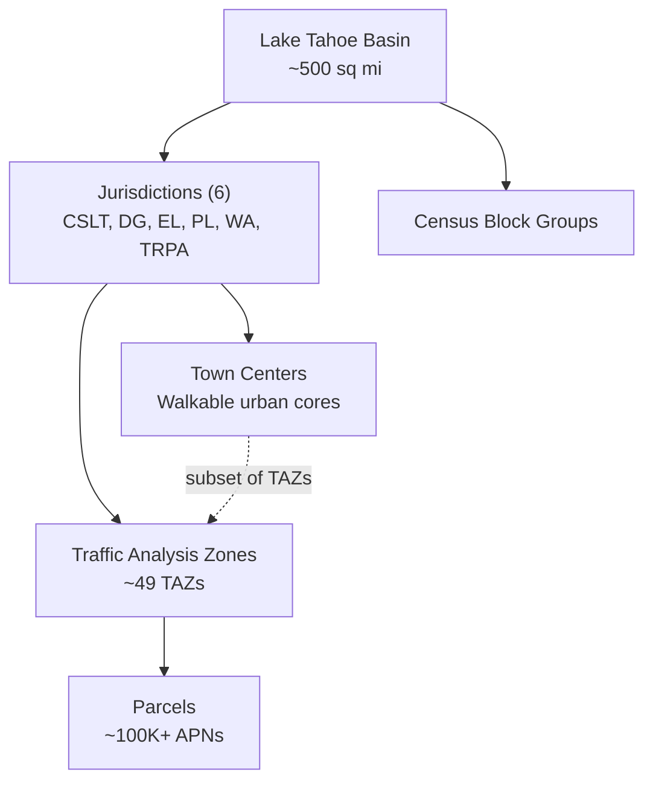
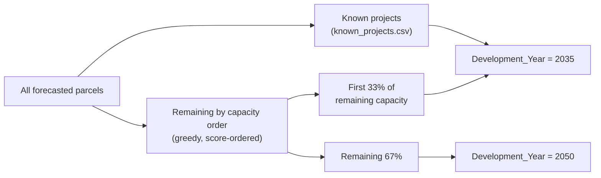
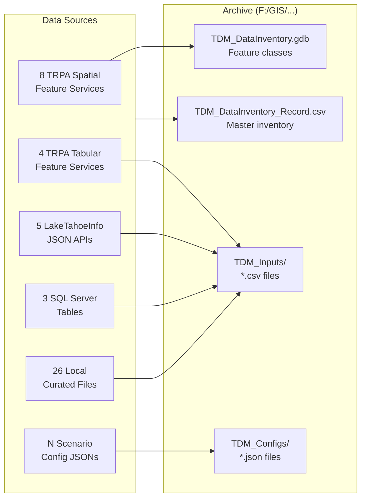

# 2026 Housing EIS — Travel Demand Model Pipeline Documentation

**Project:** Tahoe Regional Planning Agency — 2026 Housing Element EIS  
**Purpose:** Forecast socioeconomic inputs (households, persons, employment, school enrollment, visitors) for the Tahoe Basin Travel Demand Model under four housing policy alternatives (2035 and 2050 horizons)  
**Archive:** `F:/GIS/GIS_DATA/AnalysisDataArchives/CultivatingCommunityTDM/`

---

## Table of Contents

1. [Pipeline Overview](#pipeline-overview)
2. [Directory Structure](#directory-structure)
3. [Phase 1 — Base Year Data Engineering](#phase-1--base-year-data-engineering)
4. [Phase 2 — Parcel Attribution](#phase-2--parcel-attribution)
5. [Phase 3 — Batch Scenario Forecasting](#phase-3--batch-scenario-forecasting)
6. [Code Libraries](#code-libraries)
7. [Scenario Configurations](#scenario-configurations)
8. [Output Structure](#output-structure)
9. [Key Concepts](#key-concepts)
10. [Data Inventory Notebook](#data-inventory-notebook)

---

## Pipeline Overview

The pipeline has three sequential phases. Each phase produces outputs that feed the next.



### How to Run the Full Pipeline

```bash
# 1. Open ArcGIS Pro → Notebook Environment

# 2. Run Phase 1 (base year)
#    Open: Base/scripts/base_year_data_engineering.ipynb
#    Kernel: ArcGISPro → Run All

# 3. Run Phase 2 (parcel attribution)
#    Open: Forecast/scripts/parcel_attributing.ipynb
#    Kernel: ArcGISPro → Run All

# 4. Run Phase 3 (batch scenarios)
#    From Forecast/scripts/ directory:
python run_scenarios.py
#    Or with a specific config directory:
python run_scenarios.py ../configs_final_test
```

---

## Directory Structure

```
2026_Housing_EIS/
│
├── PIPELINE_DOCUMENTATION.md          ← This file
├── data_inventory.ipynb               ← Data source snapshot tool (see §10)
│
├── Base/                              ← Base year data engineering
│   ├── scripts/
│   │   ├── base_year_data_engineering.ipynb   ← Phase 1 main notebook
│   │   ├── QA_2022_vs_2026.ipynb              ← QA checks vs. 2022 base
│   │   ├── utils.py                           ← Shared Base utilities
│   │   ├── Archive/
│   │   │   └── notebook.ipynb
│   │   └── Lookup_Lists/                      ← Hand-curated reference tables
│   │       ├── closed_tourist_parcels.csv
│   │       ├── development_2022_2025.csv       ← Known unit changes 2022→2026
│   │       ├── income_census_codes.csv
│   │       ├── lookup_tau_type.csv             ← TAU type assignments
│   │       ├── occupancy_census_codes.csv
│   │       ├── singleroomoccupancy_lookup.csv
│   │       └── taz_work_from_home.csv
│   │
│   ├── data/
│   │   ├── raw_data/                          ← Source pickles & CSVs (~166 MB)
│   │   │   ├── parcel_pickle1-4.pkl           ← Parcel geometry split into 4 files
│   │   │   ├── ParcelIPESScore_093024.csv
│   │   │   ├── Employment.csv
│   │   │   ├── employment_2022_data.csv
│   │   │   ├── occupancy_rates.csv
│   │   │   ├── census_block_group_rates_2022.csv
│   │   │   ├── campground.pkl / visitor.pkl / school.pkl / summary.pkl
│   │   │   └── occupancy_rates.pkl
│   │   │
│   │   ├── processed_data/                    ← Phase 1 outputs (TDM inputs)
│   │   │   ├── SocioEcon_Summer.csv           ← Base year TAZ socioeconomic summary
│   │   │   ├── SchoolEnrollment.csv           ← Base year enrollment by school/TAZ
│   │   │   ├── OvernightVisitorZonalData_Summer.csv
│   │   │   ├── VisitorOccupancyRates_Summer.csv
│   │   │   ├── taz_summarized.csv
│   │   │   ├── inputs_summarized.csv
│   │   │   ├── parcels_base_year.gdb/         ← Spatially attributed parcel GDB
│   │   │   ├── Base_WFH/                      ← WFH variant outputs
│   │   │   └── Archive/                       ← Timestamped prior runs
│   │   │
│   │   └── misc/                              ← Reference & calibration data
│   │       ├── taz_calibration_values.csv
│   │       ├── taz_calibration_values_final.csv
│   │       ├── taz_block_group_crosswalk.csv
│   │       ├── taz_household_size.csv
│   │       ├── taz_values_acs.csv
│   │       └── (13 reference CSVs total)
│   │
│   └── metadata/
│       ├── base_year_data_engineering_methods.md
│       ├── Campground_Occupancy_Rate_Methodology.docx
│       └── TAU_Occupancy_Methodology_DRAFT.docx
│
└── Forecast/                          ← Scenario forecasting
    ├── scripts/
    │   ├── run_scenarios.py                   ← Phase 3 main entry point
    │   ├── forecast_functions.py              ← Core forecast logic (597 lines)
    │   ├── utils.py                           ← Forecast utilities (830 lines)
    │   ├── parcel_attributing.ipynb           ← Phase 2 main notebook
    │   ├── Additional_Jobs.ipynb              ← Employment supplemental
    │   ├── Job_Distribution.ipynb             ← Spatial job distribution
    │   ├── Scenario_Forecast.ipynb            ← Interactive scenario runner
    │   ├── Summary.ipynb                      ← Cross-scenario analysis
    │   ├── lookuplist_data_engineering.ipynb  ← Lookup table maintenance
    │   └── Lookup_Lists/                      ← Forecast reference tables
    │       ├── forecast_residential_zoned_units.csv   ← Target units by pool/jurisdiction
    │       ├── forecast_residential_assigned_units.csv ← Pre-assigned projects
    │       ├── forecast_tourist_zoned_units.csv
    │       ├── forecast_tourist_assigned_units.csv
    │       ├── forecast_commercial_zoned_units.csv
    │       ├── forecast_commercial_assigned_units.csv
    │       ├── known_projects.csv                     ← Permitted/pending projects
    │       ├── bonus_unit_bndy.csv
    │       └── CTC_AssetLands_Lookup.csv
    │
    ├── configs_final/                         ← Production scenario configs (JSON)
    │   ├── alternative_1_04282026_config.json
    │   ├── alternative_2_04282026__config.json
    │   ├── alternative_3_04282026__config.json
    │   └── alternative_4_04282026__config.json
    ├── configs/                               ← Initial config versions
    ├── configs_wfh/                           ← Work-from-home variants
    ├── configs_final_test/                    ← Test/dev configs
    │
    ├── data/
    │   ├── inputs/                            ← Shared forecast inputs
    │   │   ├── OvernightVisitorZonalData_Summer.csv
    │   │   ├── employment_2035.csv
    │   │   ├── employment_2050.csv
    │   │   ├── res_assigned_lookup.csv        ← Occupancy/income for known projects
    │   │   ├── forecast_residential_zoned_units_base.csv
    │   │   ├── taz_towncenter_jobs.csv        ← Town center employment multipliers
    │   │   ├── taz_towncenter_jobs_alt_2.csv
    │   │   ├── taz_towncenter_jobs_alt_3.csv
    │   │   ├── taz_towncenter_jobs_alt_4.csv
    │   │   └── taz_work_from_home.csv
    │   │
    │   └── processed_data/
    │       ├── base_data/                     ← Phase 2 outputs (shared across scenarios)
    │       │   ├── base_parcel_data.parquet   ← 3.3 MB attributed parcel data
    │       │   ├── attributed_parcels.geoparquet ← 2.8 MB with geometry
    │       │   ├── persons_per_occ_unit_2035.csv
    │       │   └── persons_per_occ_unit_2050.csv
    │       │
    │       └── run_YYYY-MM-DD_HHMMSS/        ← Timestamped batch run outputs
    │           ├── {scenario_name}/2035/
    │           ├── {scenario_name}/2050/
    │           ├── all_scenarios_parcels.parquet
    │           ├── all_scenarios_parcels.shp
    │           └── configs/
    │
    ├── Alternative_1/                         ← Scenario working directories
    │   ├── Alternative_1_Forecast.ipynb
    │   ├── alternative_1_config.json
    │   ├── built_parcels.csv
    │   ├── jurisdiction_pools.csv
    │   └── data/ + inputs/
    ├── Alternative_2/ ... Alternative_4/      ← Same structure
    │
    └── README.md
```

---

## Phase 1 — Base Year Data Engineering

**Script:** `Base/scripts/base_year_data_engineering.ipynb`  
**Environment:** ArcGIS Pro Jupyter (requires `arcpy`, `arcgis`, `pandas`)

This notebook builds the base year Travel Demand Model inputs from raw parcel data and external services. It runs once per base year update and produces the four CSV files that are the primary inputs to the travel model.

### Inputs

| Source | File / Service | Description |
|--------|---------------|-------------|
| Pickle | `raw_data/parcel_pickle1-4.pkl` | Parcel geometry split into 4 files |
| CSV | `raw_data/ParcelIPESScore_093024.csv` | IPES scores for development eligibility |
| CSV | `raw_data/employment_2022_data.csv` | 2022 employment by TAZ and category |
| CSV | `raw_data/occupancy_rates.csv` | Observed TAU/VHR occupancy rates |
| CSV | `raw_data/census_block_group_rates_2022.csv` | Frozen 2022 ACS demographics |
| Pickle | `raw_data/campground.pkl / visitor.pkl / school.pkl` | Visitor & school raw data |
| REST | `TRPA/Existing_Development/MapServer/2` | Parcel features (Year=2026) |
| REST | `TRPA/Transportation_Planning/MapServer/6` | TAZ boundaries |
| REST | `TRPA/Demographics/MapServer/27` | Census block groups |
| REST | `TRPA/Transportation_Planning/MapServer/14` | Campground visitation (Year=2022) |
| REST | `TRPA/Transportation_Planning/MapServer/17` | School enrollment (Year=2021-2022) |
| REST | `TRPA/Recreation/MapServer/1` | Campground locations |
| REST | `TRPA/Transportation_Planning/MapServer/15` | Occupancy zones |
| SQL | `sde.SDE.PermissibleUses` | Zoning permissible use by parcel |
| Lookup | `Lookup_Lists/development_2022_2025.csv` | Known unit changes 2022→2026 |
| Lookup | `Lookup_Lists/lookup_tau_type.csv` | TAU type by APN |
| Lookup | `Lookup_Lists/closed_tourist_parcels.csv` | Permanently closed TAU parcels |
| Lookup | `Lookup_Lists/income_census_codes.csv` | ACS income category crosswalk |
| Ref | `misc/taz_calibration_values_final.csv` | TAZ calibration targets |
| Ref | `misc/taz_block_group_crosswalk.csv` | TAZ ↔ block group crosswalk |

### Processing Steps



### Outputs

| File | Location | Description | Key Fields |
|------|----------|-------------|------------|
| `SocioEcon_Summer.csv` | `Base/data/processed_data/` | TAZ-level socioeconomic summary | TAZ, total_residential_units, total_occ_units, occ_units_low/med/high, total_persons, emp_retail/srvc/rec/game/other, new_occupancy_rate |
| `SchoolEnrollment.csv` | `Base/data/processed_data/` | School enrollment by school area / TAZ | school_id, TAZ, elementary, middle, high, college |
| `OvernightVisitorZonalData_Summer.csv` | `Base/data/processed_data/` | Overnight visitor counts by TAZ | TAZ, hotel_motel, resort, casino, campground, seasonal |
| `VisitorOccupancyRates_Summer.csv` | `Base/data/processed_data/` | Visitor occupancy rates by TAZ | TAZ, occ_rate by accommodation type |
| `parcels_base_year.gdb` | `Base/data/processed_data/` | Spatially attributed parcels | APN, TAZ, jurisdiction, land use, existing units, IPES, zoning |

---

## Phase 2 — Parcel Attribution

**Script:** `Forecast/scripts/parcel_attributing.ipynb`  
**Environment:** ArcGIS Pro Jupyter

This notebook reads the base year parcel GDB, attaches forecast-relevant attributes (zoning capacity, occupancy/income lookups, eligibility conditions), and writes the data as Parquet for fast scenario reads. It also generates the initial persons-per-occupied-unit lookup tables.

### Inputs

| Source | File | Description |
|--------|------|-------------|
| GDB | `Base/data/processed_data/parcels_base_year.gdb` | Spatially attributed base parcels |
| REST | `TRPA/Planning/FeatureServer/3` | Town center boundaries |
| REST | `TRPA/Demographics/MapServer/28` | Census tracts |
| LTInfo | `GetParcelIPESScores/JSON/` | IPES scores (live service) |
| LTInfo | `GetParcelsByLandCapability/JSON/` | Land capability values |
| LTInfo | `GetAllParcels/JSON/` | Parcel status incl. RetiredFromDevelopment |
| LTInfo | `GetBankedDevelopmentRights/JSON/` | Banked development rights |
| LTInfo | `GetTransactedAndBankedDevelopmentRights/JSON/` | Transacted DR records |
| SQL | `sde.SDE.PermissibleUses` | Zoning permissible use table |
| SQL | `sde.SDE.Special_Designation` | Transfer/receive zone designations |
| SQL | `sde.SDE.Parcel_History_Attributed WHERE YEAR=2022` | 2022 attributed parcel snapshot |
| Lookup | `Lookup_Lists/bonus_unit_bndy.csv` | Bonus unit boundary flag by APN |
| Lookup | `Lookup_Lists/known_projects.csv` | Known development projects |
| Lookup | `Lookup_Lists/forecast_residential_zoned_units.csv` | Target unit counts by pool |
| Lookup | `Lookup_Lists/CTC_AssetLands_Lookup.csv` | CTC asset land parcels |
| Input | `Forecast/data/inputs/res_assigned_lookup.csv` | Occupancy/income for known projects |

### Outputs

| File | Location | Description |
|------|----------|-------------|
| `base_parcel_data.parquet` | `Forecast/data/processed_data/base_data/` | 3.3 MB — all parcel attributes in columnar format |
| `attributed_parcels.geoparquet` | `Forecast/data/processed_data/base_data/` | 2.8 MB — same with geometry |
| `persons_per_occ_unit_2035.csv` | `Forecast/data/processed_data/base_data/` | Initial PPU lookup by TAZ, 2035 |
| `persons_per_occ_unit_2050.csv` | `Forecast/data/processed_data/base_data/` | Initial PPU lookup by TAZ, 2050 |

---

## Phase 3 — Batch Scenario Forecasting

**Script:** `Forecast/scripts/run_scenarios.py`  
**Environment:** ArcGIS Pro Python (command line or Notebook)

This is the main engine. For each config JSON in `configs_final/`, it loads shared base data once, then runs the full forecast for every scenario, writing TDM input CSVs for both 2035 and 2050 horizons.

### Inputs

| File | Description |
|------|-------------|
| `configs_final/*.json` | One config per scenario (see §7) |
| `base_parcel_data.parquet` | Attributed parcels from Phase 2 |
| `Base/data/processed_data/SocioEcon_Summer.csv` | Base TAZ socioeconomic |
| `Base/data/processed_data/SchoolEnrollment.csv` | Base school enrollment |
| `Base/data/processed_data/VisitorOccupancyRates_Summer.csv` | Base visitor rates |
| `Forecast/data/inputs/OvernightVisitorZonalData_Summer.csv` | Overnight visitor counts |
| `Forecast/data/inputs/employment_2035.csv` | Exogenous employment forecast, 2035 |
| `Forecast/data/inputs/employment_2050.csv` | Exogenous employment forecast, 2050 |
| `base_data/persons_per_occ_unit_2035.csv` | Initial PPU lookup, 2035 |
| `base_data/persons_per_occ_unit_2050.csv` | Initial PPU lookup, 2050 |
| `Forecast/data/inputs/res_assigned_lookup.csv` | Occupancy/income overrides for known projects |
| `Forecast/data/inputs/taz_towncenter_jobs*.csv` | Town center employment multipliers (per-alternative) |

### Execution Flow

```mermaid
flowchart TD
    START(["python run_scenarios.py"]) --> SCAN
    SCAN["Scan configs_final/*.json\nDiscover all scenario configs"] --> SHARED
    SHARED["load_shared_data()\nRead parquet, CSVs, employment,\nPPU lookup — once for all scenarios"] --> LOOP

    subgraph LOOP ["For each scenario config JSON"]
        direction TB
        CFG["Parse config JSON\nscenario_name, residential_units[],\nzone_proportions, occupancy_rates,\nincome_proportions, options"] --> JUR
        JUR["forecast_jurisdiction_pools()\nAllocate 30 assignments across\nCSLT, DG, EL, PL, WA\n(Bonus, General units — MF/SF/Infill)"] --> TRPA
        TRPA["forecast_trpa_pools()\nAllocate 28 TRPA-specific types\n(Bonus, General, ADU, Affordable,\nModerate, JADU, CTC Town Center)"] --> REM
        REM["assign_remainders()\nFill remaining capacity\nand ADU fill-up pools"] --> TAG
        TAG["Tag each built parcel\nFORECAST_REASON\nFORECASTED_RESIDENTIAL_UNITS\nFORECASTED_RES_OCCUPANCY_RATE\nFORECASTED_RES_INCOME_LOW/MED/HIGH"] --> DEVYR
        DEVYR["assign_development_year()\nKnown projects → 2035\nFirst 33% capacity → 2035\nRemaining → 2050"] --> TAZ
        TAZ["build_taz_summary()\nAggregate parcels → TAZ level\nMerge with base SocioEcon\nCompute occ_units, income totals"] --> PPU
        PPU{adjust_taz\n_population?}
        PPU -- yes --> PPUADJ["adjust_taz_population()\nScale PPU to hit regional\npopulation targets\n(2035 & 2050 targets)\nSave updated PPU to base_data/"]
        PPU -- no --> PPUAPP["adjust_taz_persons_per_occ_unit()\nApply existing PPU lookup"]
        PPUADJ --> SCHOOL
        PPUAPP --> SCHOOL
        SCHOOL["adjust_school_enrollment()\nScale enrollment proportionally\nto population change vs base"] --> EMP
        EMP["update_employment_numbers()\nMerge forecast employment\n(2035 & 2050 from inputs/)"] --> OCCUADJ
        OCCUADJ{adjust_\noccupancy?}
        OCCUADJ -- yes --> OCCUMOD["adjust_occupied_units()\nScale total_occ_units\nRecompute income breakdown"]
        OCCUADJ -- no --> EXPORT
        OCCUMOD --> EXPORT
        EXPORT["Export TAZ summaries\n{scenario}/2035/SocioEcon_Summer.csv\n{scenario}/2035/SchoolEnrollment.csv\n{scenario}/2035/OvernightVisitor*.csv\n{scenario}/2035/VisitorOccupancy*.csv\n(same for 2050)"]
    end

    LOOP --> CONCAT
    CONCAT["Concatenate all scenario parcel DataFrames\nSCENARIO column added"] --> WRITE
    WRITE["Write batch outputs\nall_scenarios_parcels.parquet\nall_scenarios_parcels.shp\nconfigs/ (JSON copies)"]
```



### Per-Scenario Output Files

For each scenario and each horizon year (2035 and 2050):

| File | Description | Key Fields |
|------|-------------|------------|
| `SocioEcon_Summer.csv` | TAZ-level socioeconomic forecast | TAZ, total_residential_units, total_occ_units, occ_units_low/med/high, total_persons, emp_retail/srvc/rec/game/other, new_occupancy_rate |
| `SchoolEnrollment.csv` | Scaled school enrollment | school_id, TAZ, elementary, middle, high, college |
| `OvernightVisitorZonalData_Summer.csv` | Overnight visitor counts (passed through) | TAZ, visitor counts by accommodation type |
| `VisitorOccupancyRates_Summer.csv` | Visitor occupancy rates (passed through) | TAZ, occupancy rates by type |

### Batch Output Files

| File | Description |
|------|-------------|
| `all_scenarios_parcels.parquet` | All scenarios concatenated at parcel level; includes `SCENARIO` column |
| `all_scenarios_parcels.shp` | Shapefile version of the above for GIS use |
| `persons_per_occ_unit/` (if pop. adj.) | Updated PPU tables used in the run |
| `configs/` | Copies of all JSON configs for run provenance |

---

## Code Libraries

### `Forecast/scripts/forecast_functions.py` (597 lines)

Core forecast logic. Called by `run_scenarios.py` for every scenario.

| Function | Purpose |
|----------|---------|
| `get_adjusted_future_units()` | Apply MF/SF/Infill zone proportion splits to raw unit pool targets |
| `forecast_jurisdiction_pools()` | Greedy allocation of 30 unit assignments across 5 jurisdictions |
| `forecast_trpa_pools()` | Greedy allocation of 28 TRPA-specific pool types |
| `assign_remainders()` | Fill-up remaining capacity and ADU pools after primary allocation |
| `check_forecast_results()` | Validate forecasted totals against config targets |
| `assign_development_year()` | Tag parcels with Development_Year (2035 vs. 2050) |
| `assign_occupancy_rate()` | Map occupancy rates from `res_assigned_lookup.csv` + config overrides |
| `assign_income_categories()` | Distribute low/medium/high income fractions to forecasted units |
| `build_taz_summary()` | Aggregate parcel forecasts to TAZ; merge with base SocioEcon data |
| `adjust_taz_population()` | Fit persons-per-occ-unit to regional population targets via scaling |
| `adjust_taz_persons_per_occ_unit()` | Apply existing PPU lookup table to TAZ summary |
| `adjust_occupied_units()` | Optional occupancy scaling with income recomputation |
| `adjust_school_enrollment()` | Scale school enrollment proportionally to population delta |
| `update_employment_numbers()` | Merge forecast employment (2035/2050) into TAZ summary |
| `forecast_tourist_units()` | Assign TAUs from forecast_tourist_assigned_units.csv |
| `forecast_commercial_floor_area()` | Assign CFA from forecast_commercial_assigned_units.csv |
| `clean_taz_summary()` | Standardize field names and fix rounding inconsistencies |
| `export_forecast()` | Save parcel forecast to pickle, CSV, GDB feature class, and TAZ summary |

### `Forecast/scripts/utils.py` (830 lines)

Infrastructure and spatial utilities for the Forecast pipeline.

| Function | Purpose |
|----------|---------|
| `get_conn(db)` | SQLAlchemy connection to SQL Server (sql12/sde, sql14/tahoebmpsde) |
| `read_sql_no_geom(query, engine)` | SELECT * wrapper that strips geometry/geography columns automatically |
| `fix_sedf_geometry(sdf)` | Coerce geometry to ArcGIS Geometry objects (fixes arcgis/geopandas dtype conflict) |
| `get_fs_data(url)` | Fetch feature service as pandas DataFrame (tabular) |
| `get_fs_data_spatial(url)` | Fetch feature service as spatially-enabled DataFrame |
| `get_fs_data_query(url, params)` | Fetch feature service with SQL WHERE clause |
| `get_parcel_conditions()` | Build condition DataFrames for each unit pool × jurisdiction type |
| `forecast_residential_units()` | Greedy unit allocation to eligible parcels (scored by IPES and lot size) |
| `forecast_residential_units_infill()` | Infill allocation with minimum lot size constraints |
| `get_target_sum()` | Extract target unit count from config for a given jurisdiction + pool + type |
| `make_taz_crosswalk()` | Spatial join utility for TAZ assignment |

### `Base/scripts/utils.py` (270 lines)

Shared utilities for the Base year pipeline.

| Function | Purpose |
|----------|---------|
| `get_conn(db)` | SQL Server connection factory (same server pattern as Forecast) |
| `get_fs_data(url)` | Feature service to DataFrame |
| `get_fs_data_spatial(url)` | Feature service to spatial DataFrame |
| `check_field(df, fields)` | Add missing columns as NaN (safe merge helper) |
| `read_file(path)` | Read CSV via pathlib.Path |

---

## Scenario Configurations

Each scenario is defined by a JSON config file in `Forecast/configs_final/`. The batch runner processes all JSON files in that directory in one run.

### Config File Structure

```json
{
  "scenario_name": "Alternative_1_04282026",

  "adjust_for_occ_unit_emp": "no",
  "adjust_occupancy": "no",
  "adjust_taz_population": "yes",
  "target_population_2035": 55592,
  "target_population_2050": 57611,

  "zone_proportions": {
    "default": { "mf": 0.35, "sf": 0.50, "infill": 0.15 },
    "CSLT":    { "mf": 0.40, "sf": 0.45, "infill": 0.15 }
  },

  "occupancy_rates": {
    "Bonus":      1.00,
    "CTC":        1.00,
    "General":    0.35,
    "ADU":        0.70,
    "Affordable": 1.00,
    "Moderate":   1.00,
    "JADU":       1.00
  },

  "income_proportions": {
    "Bonus":   { "low": 0.78, "medium": 0.20, "high": 0.02 },
    "General": { "low": 0.01, "medium": 0.02, "high": 0.97 }
  },

  "residential_units": [
    { "Jurisdiction": "CSLT", "Unit_Pool": "Bonus Unit",  "Future_Units": 89  },
    { "Jurisdiction": "CSLT", "Unit_Pool": "General",     "Future_Units": 395 },
    { "Jurisdiction": "TRPA", "Unit_Pool": "TRPA General","Future_Units": 150 }
  ]
}
```

### Config Parameters Reference

| Parameter | Type | Required | Description |
|-----------|------|----------|-------------|
| `scenario_name` | string | ✓ | Unique name; used as output folder name |
| `residential_units` | array | ✓ | Unit pool targets — Jurisdiction + Unit_Pool + Future_Units |
| `zone_proportions` | object | ✓ | MF/SF/Infill split per jurisdiction; `default` applies to all not listed |
| `occupancy_rates` | object | ✓ | Fraction of allocated units that are occupied, by pool keyword |
| `income_proportions` | object | ✓ | Low/medium/high income fractions for each pool |
| `adjust_taz_population` | "yes"/"no" | — | Scale PPU to hit regional population targets |
| `target_population_2035` | number | if pop. adj. | Regional population target for 2035 |
| `target_population_2050` | number | if pop. adj. | Regional population target for 2050 |
| `adjust_occupancy` | "yes"/"no" | — | Scale occupied units by additional target |
| `adjust_for_occ_unit_emp` | "yes"/"no" | — | Add employment generated by new town-center housing |

### The Four Alternatives



| Alternative | Focus | Key Distinction |
|-------------|-------|----------------|
| Alternative 1 | Baseline housing package | Moderate growth, standard pool distribution |
| Alternative 2 | Moderate growth variant | Different jurisdiction pool emphasis |
| Alternative 3 | Higher density / infill focus | Increased town center and ADU emphasis |
| Alternative 4 | Maximum allowed growth | Highest unit targets, all pool types |

Each alternative is run with:
- **Two horizons:** 2035 and 2050
- **WFH variant** (`_wfh`): Work-from-home employment adjustment applied
- **Reduced variant** (`_reduced`): Scaled-back unit targets for sensitivity testing

---

## Output Structure

### Full Batch Run Output Tree

```
Forecast/data/processed_data/run_2026-04-28_153116/
│
├── Alternative_1_04282026/
│   ├── 2035/
│   │   ├── SocioEcon_Summer.csv
│   │   ├── SchoolEnrollment.csv
│   │   ├── OvernightVisitorZonalData_Summer.csv
│   │   ├── VisitorOccupancyRates_Summer.csv
│   │   └── alternative_1_04282026_config.json       ← provenance copy
│   └── 2050/
│       ├── SocioEcon_Summer.csv
│       ├── SchoolEnrollment.csv
│       ├── OvernightVisitorZonalData_Summer.csv
│       └── VisitorOccupancyRates_Summer.csv
│
├── Alternative_2_04282026__/
│   ├── 2035/ ...
│   └── 2050/ ...
│
├── Alternative_3_04282026__/  ...
├── Alternative_4_04282026__/  ...
│
├── persons_per_occ_unit/                             ← Only written if adjust_taz_population=yes
│   ├── persons_per_occ_unit_2035.csv
│   └── persons_per_occ_unit_2050.csv
│
├── configs/                                          ← All config JSONs for this run
│   ├── alternative_1_04282026_config.json
│   ├── alternative_2_04282026__config.json
│   ├── alternative_3_04282026__config.json
│   └── alternative_4_04282026__config.json
│
├── all_scenarios_parcels.parquet                    ← All scenarios, parcel level, concatenated
└── all_scenarios_parcels.shp  (+ .dbf, .shx, .prj) ← GIS-ready parcel output
```

### `SocioEcon_Summer.csv` — Field Reference

| Field | Description |
|-------|-------------|
| `TAZ` | Traffic Analysis Zone ID |
| `total_residential_units` | Total residential units (base + forecasted) |
| `total_occ_units` | Total occupied units |
| `occ_units_low` | Occupied units, low-income households |
| `occ_units_med` | Occupied units, medium-income households |
| `occ_units_high` | Occupied units, high-income households |
| `total_persons` | Total persons (occ_units × persons_per_occ_unit) |
| `new_occupancy_rate` | Average residential occupancy rate for the TAZ |
| `emp_retail` | Retail employment |
| `emp_srvc` | Service employment |
| `emp_rec` | Recreation employment |
| `emp_game` | Gaming employment |
| `emp_other` | Other employment (incl. town-center job add-backs if applicable) |

---

## Key Concepts

### Geographic Hierarchy



**Jurisdictions:**

| Code | Name |
|------|------|
| CSLT | City of South Lake Tahoe |
| DG | Douglas County |
| EL | El Dorado County |
| PL | Placer County |
| WA | Washoe County |
| TRPA | Regional (cross-jurisdiction pools) |

### Unit Pool Types

Residential units are allocated from distinct pools, each with different eligibility rules and occupancy/income characteristics:

| Pool | Description | Typical Occupancy | Income Profile |
|------|-------------|-------------------|----------------|
| **Bonus Unit** | Development rights transfer receiving parcels | 100% | ~78% low income |
| **General** | Standard zoned residential capacity | 35% | ~97% high income |
| **ADU** | Accessory Dwelling Units | 70% | Mixed |
| **Affordable** | Below-market affordable housing | 100% | 100% low income |
| **Moderate** | Moderate-income restricted units | 100% | ~100% medium |
| **JADU** | Junior ADUs | 100% | ~100% medium |
| **CTC / Town Center** | Town center parcels (CTC asset lands) | 100% | ~78% low |

### Unit Type Within Pools

Each pool is further split by structure type using `zone_proportions`:

| Code | Type | Description |
|------|------|-------------|
| `mf` | Multi-Family | Condos, apartments (default: 35%) |
| `sf` | Single Family | Detached homes (default: 50%) |
| `infill` | Infill | Lot splits, backfill on existing developed parcels (default: 15%) |

### Development Year Logic



### Persons-Per-Occupied-Unit (PPU) Adjustment

When `adjust_taz_population = "yes"`, the forecast uses a population-constrained mode:

1. Compute forecast total persons using base PPU rates
2. Compare regional total to `target_population_2035` / `target_population_2050`
3. Scale PPU uniformly across all TAZs to hit the regional target
4. Save updated `persons_per_occ_unit_2035/2050.csv` to `base_data/` for use by subsequent scenarios in the same batch

This ensures the regional population total matches external demographic projections while preserving the spatial distribution from the parcel forecast.

---

## Data Inventory Notebook

**File:** `data_inventory.ipynb` (at the root `2026_Housing_EIS/` directory)

This notebook creates a complete reproducibility snapshot of all data sources used across the entire pipeline. Run it once before finalizing any analysis to archive everything needed to re-run from scratch.

### What It Does



### Inventory Record Fields

| Field | Description |
|-------|-------------|
| `source_id` | Unique identifier (DS_SPATIAL_001, DS_SQL_003, etc.) |
| `source_type` | Spatial Feature Service / Tabular Feature Service / LakeTahoeInfo JSON API / SQL Server Table / Local Curated File / Scenario Config JSON |
| `source_name` | Human-readable name |
| `description` | What the data contains and why it's used |
| `datasource_url_or_path` | Live service URL or source file path |
| `query_filter` | SQL WHERE clause applied when fetching |
| `scripts_used_in` | Pipe-separated list of scripts that use this source |
| `archive_type` | Feature Class (GDB) / CSV / JSON (copy) |
| `archive_filename` | File or feature class name in the archive |
| `archive_full_path` | Absolute path to the archived copy |
| `record_count` | Number of rows / features written |
| `status` | SUCCESS / ERROR / SKIP |
| `snapshot_date` | Date the snapshot was taken |

### Running the Inventory Notebook

```
Prerequisites:
  - ArcGIS Pro Jupyter kernel
  - F:/GIS/.../TDM_DataInventory.gdb writeable
  - DB_USER and DB_PASSWORD environment variables set (for SQL sections)
  - Network access to maps.trpa.org and laketahoeinfo.org

Open: data_inventory.ipynb
Run All Cells (estimated runtime: 20–40 min depending on parcel layer size)
```
